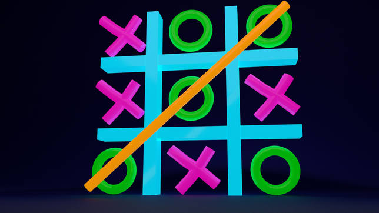

Trabajo realizado en JavaScript

## Instrucciones

Se nos puso como trabajo realizar el juego del 3 en raya en JavaScript.
Las instrucciones que nos proporcionó como requisitos o ayudas del profesor fueron las siguientes:

### Valores

0 = vacío
1 = cruz
2 = círculo

### Condiciones 

- Tener como mínimo 3 funciones en JS llamadas: puedoColocar(), juego() y juegoTerminado().
- Tiene que tener 2/3 imagenes para las fichas (cuadro blanco, círculo y cruz).
- La función juego() tiene que colocar la ficha correspondiente (círculo o cruz).
- juegoTerminado() devuelve false si no ha terminado, empate en el caso de empate o te muestre el ganador en caso de que haya un ganador. 
